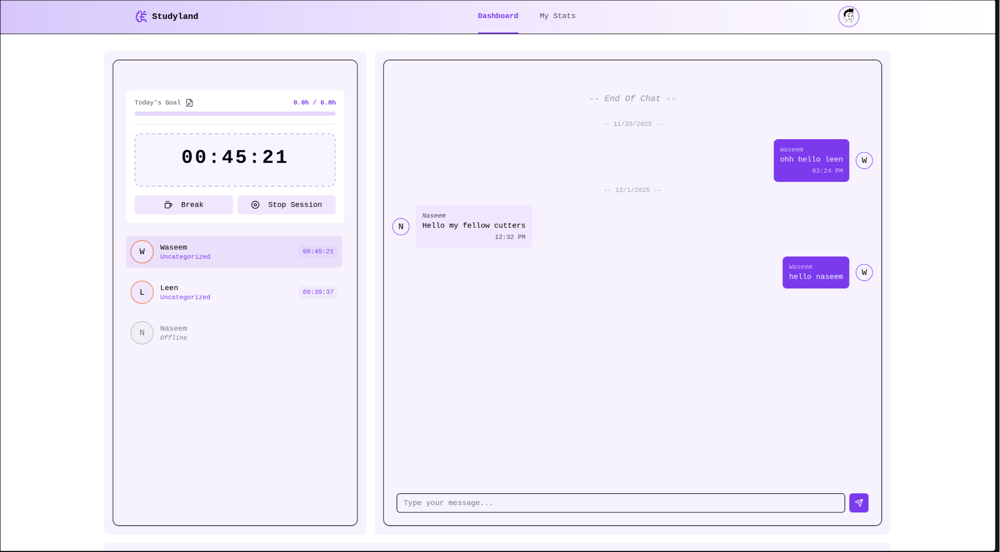
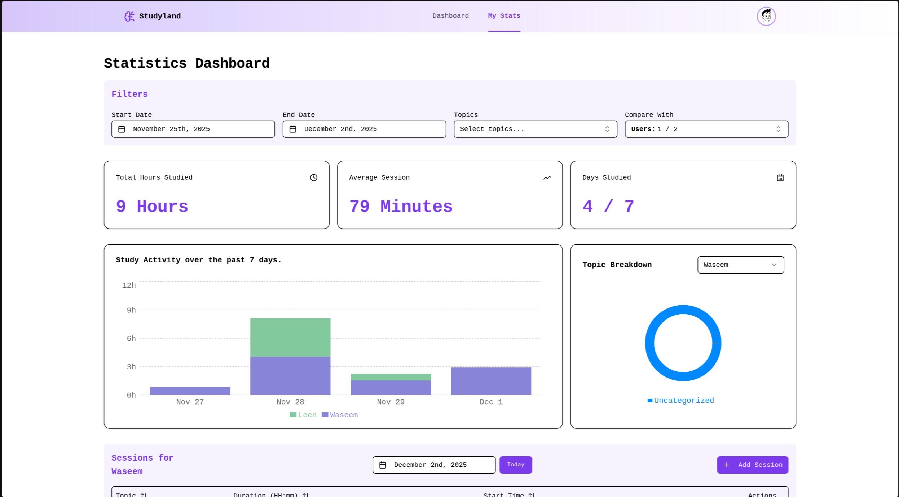

**Studyland** is a full-stack, real-time social study platform designed to help users track their study hours, analyze their performance, and study alongside friends in virtual rooms.

Built with a focus on **Clean Architecture** utilizing **Vertical Slices** and **Domain-Driven Design (DDD)** principles, it leverages the power of **.NET 9** for a robust backend and **React 19** for a high-performance, responsive frontend.

[Live Site](https://studyland.rufususmle.com)






---

## Live Demo & Access

**Live URL:** [studyland.rufususmle.com](https://studyland.rufususmle.com)

To immediately explore the real-time features and architecture of the platform, use the dedicated demo account:

- **Email:** `demo@example.com`
- **Password:** `demouser`

---

## Architecture: Clean Architecture & Vertical Slices

The solution follows a strict **Clean Architecture** approach, further organized by **Vertical Slices** within the Application layer. This ensures that all logic related to a specific feature (e.g., "Sessions") is cohesive and easy to maintain.

### Backend Layers

- **`Domain`**: The core of the application. Contains enterprise logic and entities (`User`, `Session`, `Topic`) with zero external dependencies.
- **`Application`**: Implements business logic using **CQRS** (Command Query Responsibility Segregation) via **MediatR**.
  - **Vertical Slices**: Features are organized by domain area, keeping related logic together.
  - **Behaviors**: Cross-cutting concerns like Validation are handled via MediatR Pipeline Behaviors.
- **`Persistence`**: Implements database access using **Entity Framework Core** with SQL Server.
- **`API`**: The entry point, containing minimal controllers that delegate execution immediately to MediatR.

---

## Core Features

- **Real-time Presence:** Users can instantly track the status of friends (Studying, On Break) via a high-performance, in-memory **SignalR Presence System**.
- **Advanced Analytics:** Tracks study sessions by topic and time, generating robust analytics for personalized dashboard insights.
- **Full-Stack Type Safety:** Utilizes auto-generated API clients and type-safe SignalR wrappers to ensure zero-tolerance for contract drift between **C#** and **TypeScript/React**.

---

## End-to-End Type Safety

One of the project's core philosophies is eliminating "magic strings" and runtime errors through rigorous type safety across the full stack.

### 1. Auto-Generated API Client

The API endpoints return DTOs with precise annotations. We utilize the OpenAPI specification generated by the backend to automatically build the frontend client.

- **Tooling**: `openapi-typescript-codegen` scans the live Swagger/OpenAPI JSON.
- **Benefit**: This generates a fully typed **Axios client** for React. If a DTO property changes in C#, the frontend build will fail immediately, guaranteeing perfect synchronization between backend and frontend.

### 2. Type-Safe SignalR Wrapper

Standard SignalR calls like `hub.invoke("MethodName")` are error-prone. I implemented a **generic TypeScript wrapper** to enforce type safety on real-time events.

- **Implementation**: By defining interfaces for `ServerToClientEvents` and `ClientToServerEvents`, the wrapper ensures that you can only invoke methods that actually exist on the Hub, with the correct payload types.

---

## Deep Dive: Real-Time State Management (SignalR)

One of the most complex parts of Studyland is managing the real-time state of users (Online, Studying, On Break) without overloading the database. This is achieved through a sophisticated **in-memory state machine** supported by background workers.

### 1. The `PressenceService` (Singleton)

This service acts as the source of truth for all active WebSocket connections.

- **Connection Mapping**: It maintains concurrent dictionaries to map `ConnectionId` ↔ `UserId` ↔ `ChannelId`.
- **State Management**: When a user joins, their profile is fetched from the DB once and cached. Subsequent updates mutate this in-memory state, ensuring **O(1)** performance.

### 2. Custom Hooks (`usePressence`)

On the frontend, complex real-time logic is abstracted into custom hooks like `usePressence`.

- **Role**: Manages the subscription to SignalR events and synchronizes local React state with the server's in-memory presence list, keeping UI components declarative.

### 3. Background Jobs (Hosted Services)

To maintain data integrity and automate state transitions, two `IHostedService` jobs run in the background:

- **`ZombieSessionsKiller`**: Runs periodically to identify "orphaned" connections (users with no active SignalR socket) and cleanly removes them or stops their study session, ensuring accurate room listings.
- **`StudyTimerMonitor`**: Scans the in-memory state for expired timers. It automatically transitions users from **"Studying"** to **"On Break"** and broadcasts the update to the room, ensuring synchronized timer states for all peers.

---

## UI/UX & PWA

The frontend is designed to be beautiful, responsive, and app-like.

- **Stack**: Built with **Shadcn UI** and **Tailwind CSS** for a modern, accessible, and clean aesthetic.
- **Animations**: Utilizes **Framer Motion** for smooth transitions and interactive feedback.
- **PWA (Progressive Web App)**: Fully optimized to run on all devices. Installable and responsive, providing a native mobile app experience directly from the browser.

---

## Custom Validation Extensions

To keep validation logic readable and expressive, custom extension methods were built for **FluentValidation**.

- **`.Required()`**: A shorthand that combines `.NotEmpty()` with a standardized error message format.
- **`.MustExistInDb<T>`**: A powerful generic extension that validates foreign keys. It takes a generic `DbSet<T>` and automatically performs an asynchronous `AnyAsync` check against the database.

```csharp
// Inside CreateSession.Validator
RuleFor(x => x.UserId)
    .Required()
    .MustExistInDb(context.Users); // Automatically checks DB and returns 404-style error if missing
```

---

## Setup & Installation

To run this project locally, start by cloning the repository:

```bash
git clone https://github.com/WaseemAldemeri/Studyland.git
cd Studyland
```

### Docker Compose (Recommended)

This method only requires **Docker** to be installed and handles the database, backend, and frontend containers automatically.

```bash
docker compose -f docker-compose.prod.yml up --build -d
```

Once the containers are running, navigate to **http://localhost:3000** and log in with the seeded demo user:

- **Email:** `demo@example.com`
- **Password:** `demouser`

### Manual Local Development

Requires **Node.js** and the **.NET 9 SDK**.

**1. Database** — Install SQL Server locally or run the database only using Docker:

```bash
docker compose up -d
```

**2. Backend:**

```bash
cd backend/API
dotnet restore
dotnet watch run
```

**3. Frontend:**

```bash
cd frontend
npm install
npm run dev
```

---

*This project is released under the MIT License.*
